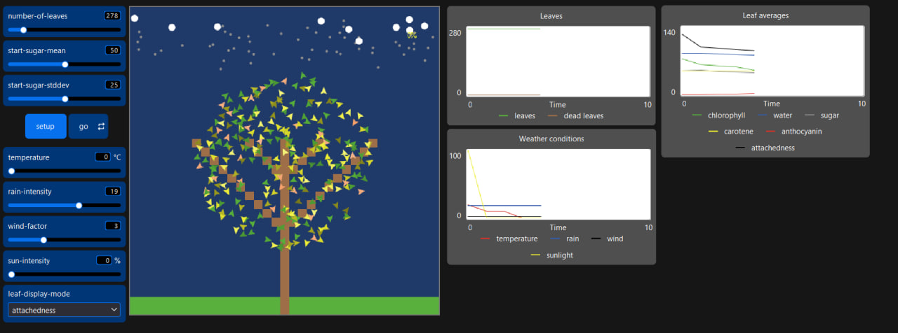
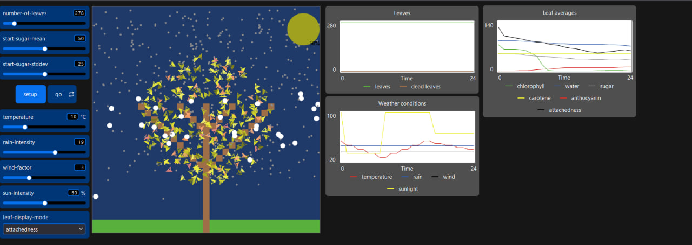
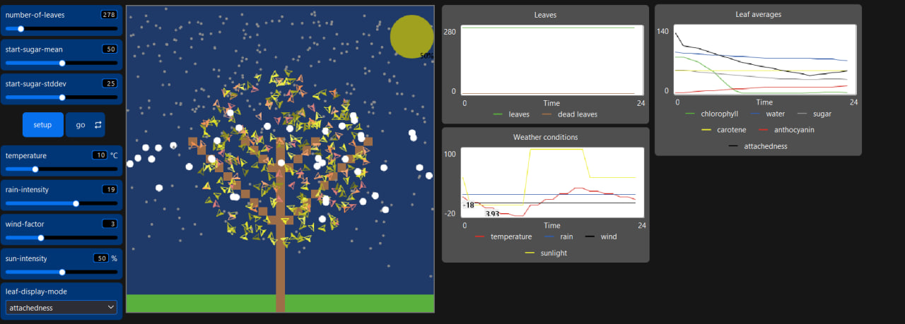
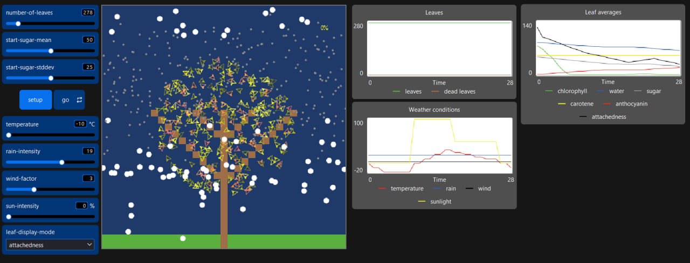

## Комп'ютерні системи імітаційного моделювання

## СПм-24-4, Олефіренко Ярослав Вадимович

### Лабораторна робота **№2**. Редагування імітаційних моделей у середовищі NetLogo

### Варіант 11, модель у середовищі NetLogo:

[Autumn](https://www.netlogoweb.org/launch#http://www.netlogoweb.org/assets/modelslib/Sample%20Models/Biology/Autumn.nlogo)

### Внесені зміни у вихідну логіку моделі, за варіантом:

Задано початкові значення для **day-long-ticks** та **current-day-tick** у процедурі **setup**:
<pre>
to setup
  set day-long-ticks 48
  set current-day-tick 0 
end
</pre>

Додано процедуру change-sun-intensity-and-temperature, яка регулює інтенсивність сонячного світла та температуру залежно від часу. На початку процедури обчислюється поточний час як **let time-of-day** **current-day-tick** / **day-long-ticks** * 24 для 24-годинної доби. Потім, залежно від часу, задаються значення для сонця та температури:
<pre>
  to change-sun-intensity-and-temperature
  let time-of-day current-day-tick / day-long-ticks * 24

  if time-of-day >= 0 and time-of-day < 8 [
    ;; Ніч: сонце не світить
    set sun-intensity 0
    set temperature (adjust-temparature-limits temperature - 10)
  ]

  if time-of-day >= 8 and time-of-day < 16 [
    set sun-intensity 100
    set temperature (adjust-temparature-limits temperature + 10)
  ]

  if time-of-day >= 16 and time-of-day < 24 [
    set sun-intensity 50
    set temperature (adjust-temparature-limits temperature - 5)
  ]
end
</pre>

**Ніч, час 00:01 - 08:00**
 
Інтенсивність сонця - 0, температура знижується на 10 градусів
 

 

**День, час 08:01 - 16:00**
 
Інтенсивність сонця - 100, температура збільшується на 10 градусів
 

 

**Вечір, час 16:00 - 00:00**
 
Інтенсивність сонця - 50, температура знижується на 5 градусів
 

 

Для контролю допустимих значень температури **set temperature** регулюється функцією **adjust-temparature-limits**
<pre>
to-report adjust-temparature-limits [ temper ]
  if temper < -10 [ report -10 ]
  if temper > 40 [ report 40 ]
  report temper
end
</pre>

### Додаткові зміни до початкової моделі:

**Додано опади у вигляді снігу при від’ємній температурі**

**Змінено тип опадів залежно від температури**
температура > 0 - дощ
температура ≤ 0 - сніг

<pre>
to make-rain-fall-or-snow
  ifelse temperature > 0 [
    create-raindrops rain-intensity [
      setxy random-xcor max-pycor
      set heading 180
      fd 0.5 - random-float 1.0
      set size .3
      set color gray
      set location "falling"
      set amount-of-water 10
    ]
  ] [
    create-raindrops snow-intensity [
      setxy random-xcor max-pycor
      set heading 180
      fd 0.5 - random-float 1.0
      set size .8
      set color white  
      set location "falling"
      set amount-of-water 10
    ]
  ]
  
  ask raindrops [ fd random-float 2 ]
end
</pre>

Внесено зміни в керування параметрами **day-long-ticks** та **current-day-tick** у процедурі **go**:
<pre>
  ifelse current-day-tick < day-long-ticks [
    if current-day-tick mod 2 = 0 [
      change-sun-intensity-and-temperature
    ]
    set current-day-tick current-day-tick + 2
  ] [
    set current-day-tick 0
  ]
</pre>

Для керування добовими циклами створено глобальні атрибути **day-long-ticks** і **current-day-tick**, які визначають тривалість “доби” в тактах та поточний такт:
<pre>
globals [
  day-long-ticks
  current-day-tick    
]
</pre>

Додано добові цикли зміни інтенсивності сонячного світла, що впливають і на температуру. 
Тривалість модельної “доби” встановлюється як внутрішній параметр.

Тривалість модельної "доби" встановлюється у внутрішніх параметра

**Зменшено міцність прикріплення листя при снігу,**
При від’ємній температурі вага снігу впливає на те, наскільки швидко листя обпадає. Створено метод, який знижує параметр attachedness для “живого” листя при снігу:

<pre>
to adjust-snow-attachedness
  if temperature < 0 [
    ask leaves with [attachedness > 0] [
      set attachedness attachedness - 2
    ]
  ]
end
</pre>

Фінальний код моделі та її інтерфейс доступні за [посиланням](Autumn.nlogox).
 

## Обчислювальні експерименти

### 1. Вплив змісту цукру на показники Хлорофілу (зелений колір), Каротину (жовтий колір) та Антоціану (червоний колір) у листі

Вивчено вплив вмісту цукру на показники Хлорофілу, Каротину та Антоціану у листі (зміну забарвлення листя) протягом 75 тактів.
Експерименти проводяться з вмістом цукру від 10 до 100 % з кроком 10. Інші параметри мають значення за замовчуванням::

- **number-of-leaves**: 700
- **start-sugar-stddev**: 25
- **temperature**: - змінна залежно від часу
- **rain-intensity**: 19
- **wind-factor**: 3
- **sun-intensity**: - змінна залежно від часу

<table>
<thead>
<tr><th>Зміст Цукру</th><th>Хлорофіл Початковий</th><th>Хлорофіл Кінцевий</th><th>Каротин Початковий</th><th>Каротин Кінцевий</th><th>Антоціан Початковий</th><th>Антоціан Кінцевий</th></tr>
</thead>
<tbody>
<tr><td>10</td><td>73.5</td><td>0</td><td>47.8</td><td>92</td><td>0.61</td><td>22.3</td></tr>
<tr><td>20</td><td>74.8</td><td>0</td><td>51</td><td>68</td><td>0.82</td><td>4.1</td></tr>
<tr><td>30</td><td>74.2</td><td>0</td><td>49.4</td><td>29</td><td>0</td><td>1.9</td></tr>
<tr><td>40</td><td>75.1</td><td>0</td><td>46.9</td><td>17</td><td>0.96</td><td>25.6</td></tr>
<tr><td>50</td><td>72.9</td><td>0</td><td>49.5</td><td>36</td><td>0</td><td>24.7</td></tr>
<tr><td>60</td><td>73.7</td><td>0</td><td>47.9</td><td>81</td><td>0</td><td>27.1</td></tr>
<tr><td>70</td><td>74.6</td><td>0</td><td>50.2</td><td>73</td><td>0</td><td>27.4</td></tr>
<tr><td>80</td><td>74.5</td><td>0</td><td>48.8</td><td>28</td><td>0</td><td>29.9</td></tr>
<tr><td>90</td><td>74.1</td><td>0</td><td>49.9</td><td>51.4</td><td>1</td><td>29.1</td></tr>
<tr><td>100</td><td>73.9</td><td>0</td><td>48.5</td><td>32</td><td>0</td><td>27.5</td></tr>
</tbody>
</table>

Висновки експерименту:

- Зміна часу доби не впливає на те, що листя може залишитися зеленим.
- Вміст каротину та антоціану зростає поступово, оскільки зміна сонця та температури живить листя вдень, а ввечері і вночі листя поступово втрачає природне живлення, роблячи модель більш реалістичною.
- При змінному часі доби вміст каротину та антоціану зростає повільніше порівняно з фіксованими температурою та сонячною інтенсивністю, а листя набуває жовто-червоного кольору повільніше.
