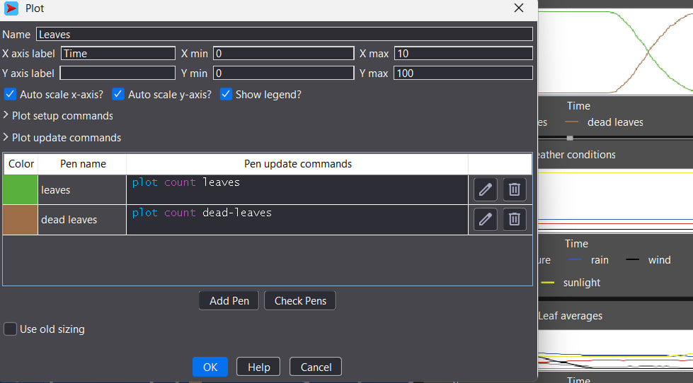
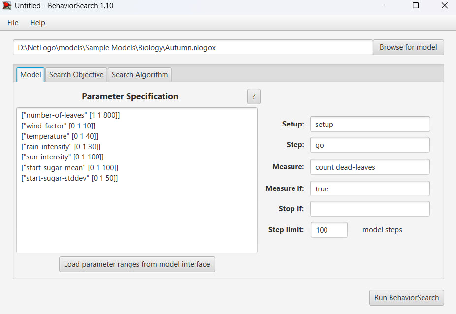
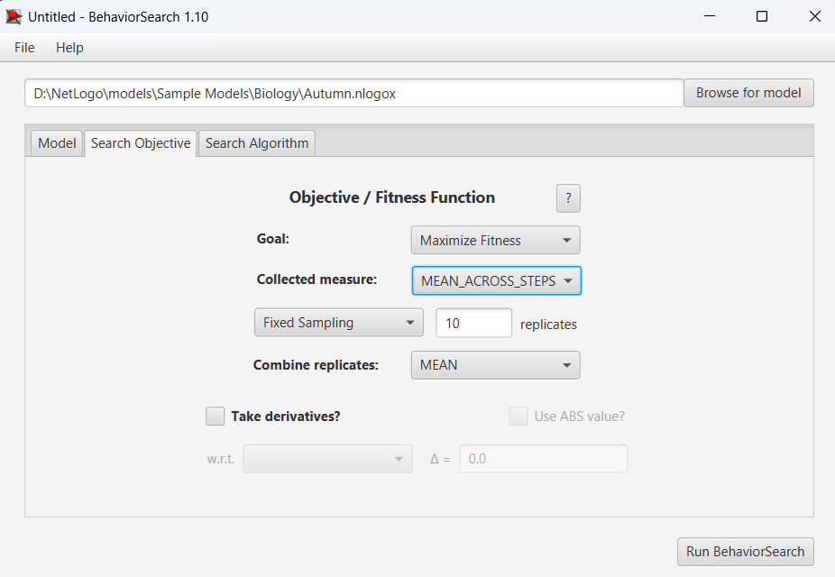
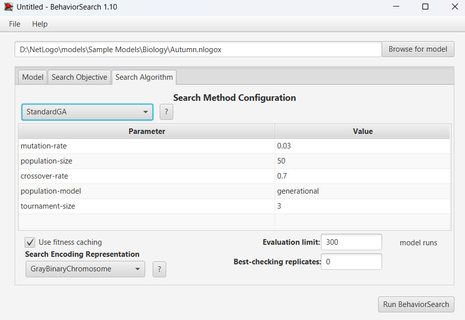
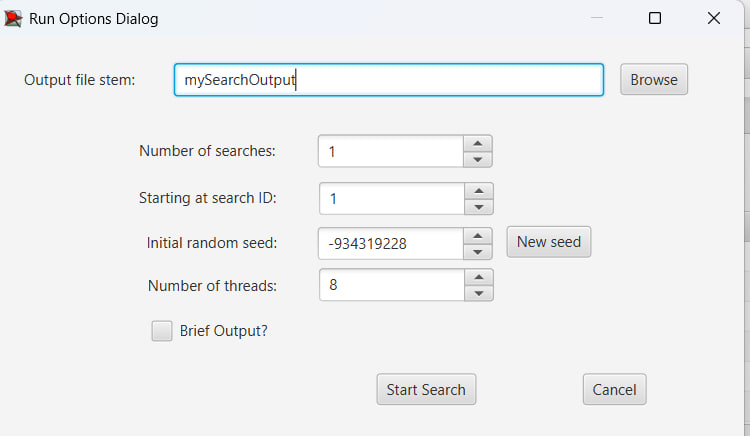
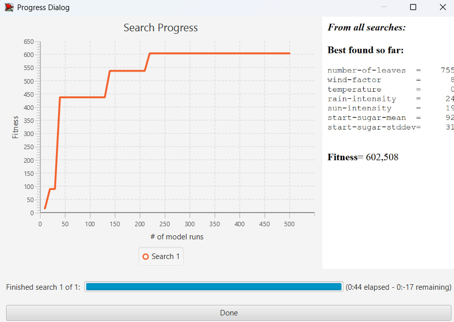
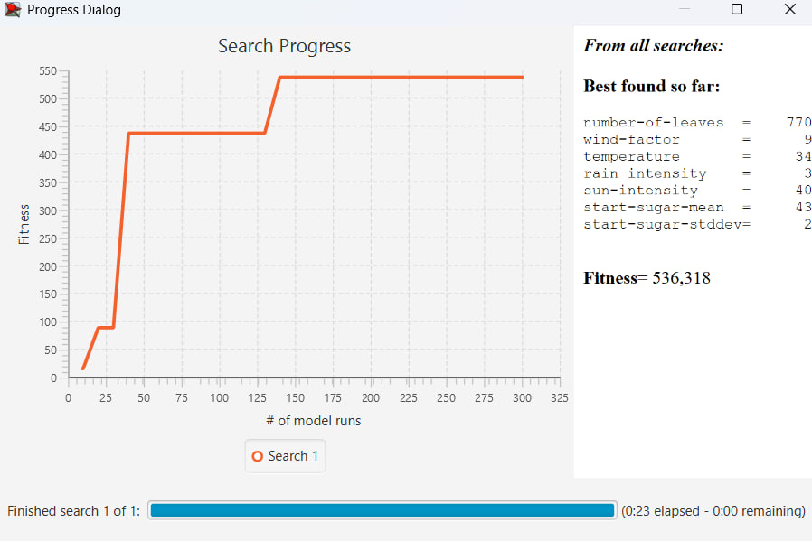
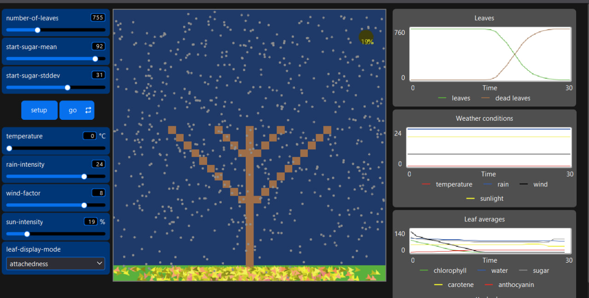

## Комп'ютерні системи імітаційного моделювання

## СПм-24-4, Олефіренко Ярослав Вадимович

### Лабораторна робота **№3**. Використання засобів обчислювального інтелекту для оптимізації імітаційних моделей

### Варіант 11, модель у середовищі NetLogo:

[Autumn](http://www.netlogoweb.org/launch#http://www.netlogoweb.org/assets/modelslib/Sample%20Models/Biology/Autumn.nlogo)

### Внутрішні параметри:

- **water-level** - показує рівень води в листі.
- **sugar-level** - відображає вміст цукру в листі.
- **attachedness** - визначає міцність прикріплення листа до гілки.
- **chlorophyll** - рівень хлорофілу, що надає зеленого забарвлення.
- **carotene** - рівень каротину, що надає жовтого кольору.
- **anthocyanin** - рівень антоціану, що надає червоного кольору.
- **location** - відображає розташування крапель дощу (“падає”, “у коренях”, “у стовбурі”, “у листі”).
- **amount-of-water** - кількість води в середовищі.
- **bottom-line** - рівень, що вказує на місцезнаходження поверхні землі.
- **evaporation-temp** - температура випаровування води.

### Керуючі параметри:

- **number-of-leaves** - цей параметр визначає, скільки листя буде на деревах на початку симуляції. За допомогою слайдера можна змінювати його значення, контролюючи кількість листя для симуляції.
- **start-sugar-mean** - вказує середнє значення вмісту цукру в листі.
- **start-sugar-stddev** - вказує температуру навколишнього середовища.
- **temperature** - цей параметр вказує, на температуру навколишнього середовища.
- **rain-intensity** - регулює інтенсивність опадів.
- **wind-factor** - задає силу вітру.
- **sun-intensity** - вказує на рівень сонячної активності.

### Показники роботи системи:

- **Leaves**: графік, що показує кількість живих і опалих листків.
- **Weather conditions**: графік, що ілюструє погодні умови, такі як дощ, сонячна активність, температура та вітер.
- **Leaf averages**: графік, що демонструє середні значення для хлорофілу, води, цукру, каротину, антоціану і показника міцності прикріплення листя.
### Налаштування середовища BehaviorSearch:

**Обрана модель**:
/NetLogo\models\Sample Models\Biology\Autumn.nlogox

**Параметри моделі** (вкладка Model):

<pre>
["number-of-leaves" 800]
["wind-factor" [0 1 10]]
["temperature" [0 1 40]]
["rain-intensity" [0 1 30]]
["sun-intensity" [0 1 100]]
["start-sugar-mean" [0 1 100]]
["start-sugar-stddev" 25]
</pre>

number-of-leaves було встановлено в значення 800 та start-sugar-stddev у значення 25. Для спрощення виконання алгоритмів.

**Використовувана міра**:  
Для фітнес-функції було обрано **кількість мертвого листя** враховуючи багато факторів впливу на то, з якою швидкістю помре листя.

<pre>count dead-leaves</pre>

За цим показником можна спостерігати, при яких значеннях ефективність випадання листя буде найсильнішим.

Ефективність випадання листя повинна враховуватися **в середньому** за весь період симуляції тривалістю 100 тактів (адже на кожному такті є своя кількість мертвого листя), починаючи з 0 такту симуляції.

Параметр зупинки за умовою (**Stop if**) не використовувався.

**Загальний вигляд вкладки налаштувань параметрів моделі:**  

**Налаштування цільової функції** (вкладка Search Objective):  

Метою вибору параметрів для показника **count dead-leaves** є ефективністю впливу природних факторів на показники метвого листя "**Goal**" зі значенням 
**Maximize Fitness**. Іншими словами, завданням є знаходження таких параметрів, за яких досягається найвищий показник мертвого листя. При цьому цікавить результат не у
якийсь окремий момент симуляції, а середнє її значення за всю симуляцію (тривалість якої 100 тактів).
*Collected measure**", що визначає спосіб обліку значень обраного показника, вказано **MEAN_ACROSS_STEPS**.  
Щоб уникнути викривлення результатів через випадкові значення, що використовуються в логіці самої імітаційної моделі, **кожна симуляція повторюється по 10 разів**,
результівне значення розраховується як **середнє арифметичне**.
Загальний вигляд вкладки налаштувань цільової функції:  

**Налаштування алгоритму пошуку** (вкладка Search Algorithm):

**Загальний вид вкладки налаштувань алгоритму пошуку:**

### Результати використання BehaviorSearch:

**Діалогове вікно запуску пошуку:**  

**Результати пошуку параметрів імітаційної моделі з використанням генетичного алгоритму:**

**Результат пошуку параметрів імітаційної моделі, використовуючи випадковий пошук:**  

 
Генетичний алгоритм: Графік чітко показує роботу еволюції. Ми бачимо кілька сходинок (приблизно на 20, 40, 130 і 220 прогонах). Це моменти, коли алгоритм знаходив кращу комбінацію генів (наприклад, "а що, якщо знизити температуру ще більше?").
 
Випадковий пошук: Графік показує характерну проблему "сліпого" пошуку у багатовимірному просторі. Він знайшов непогане значення (за рахунок сильного вітру) на початку, але ймовірність випадково згенерувати комбінацію "Холод + Дощ + Вітер" одночасно виявилася надто низькою.
 

### Висновок та тестування в NetLogo
Генетичний алгоритм виявився набагато ефективнішим для цієї задачі. Він зміг виявити логічний фізичний зв'язок: Холод + Негода = Швидка смерть листя. Випадковий пошук не зміг подолати бар'єр високої температури, залишившись у менш ефективній зоні пошуку.

